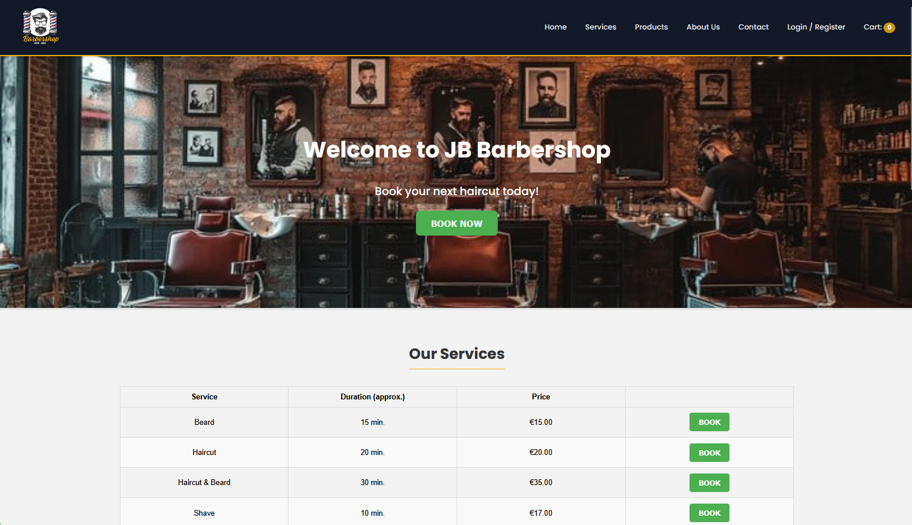
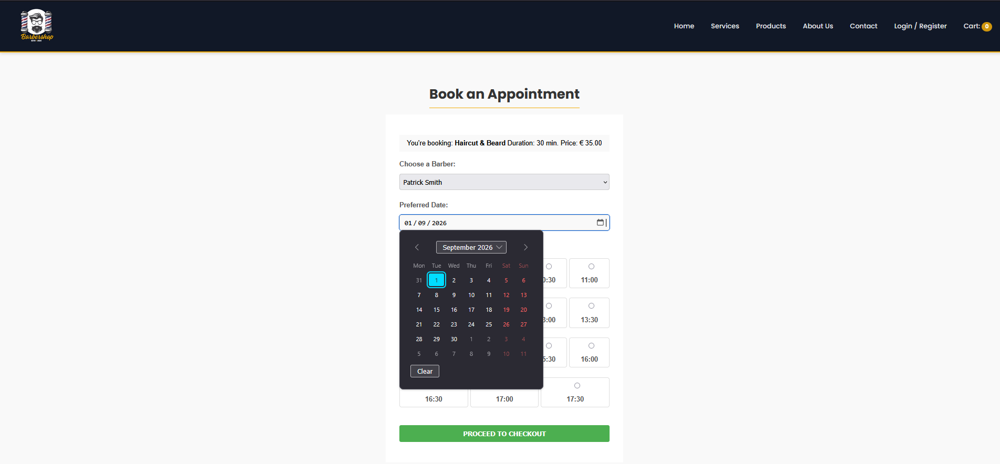
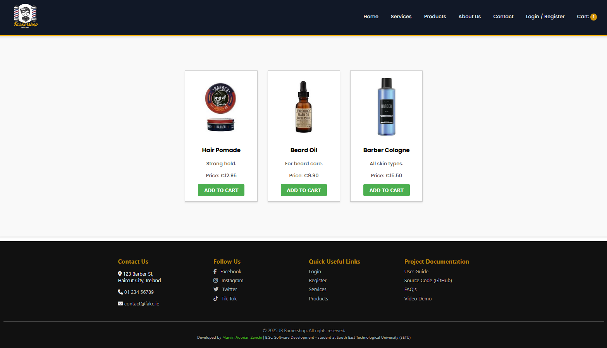
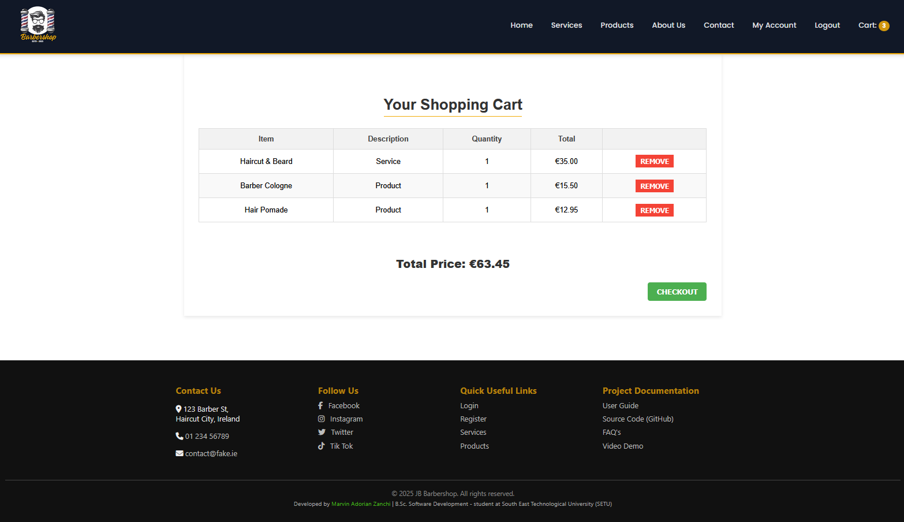
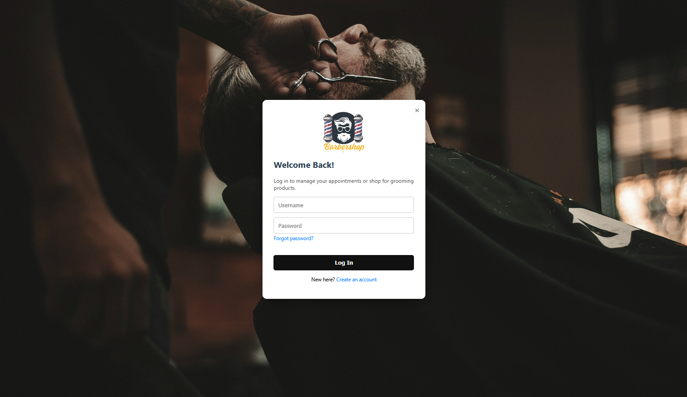
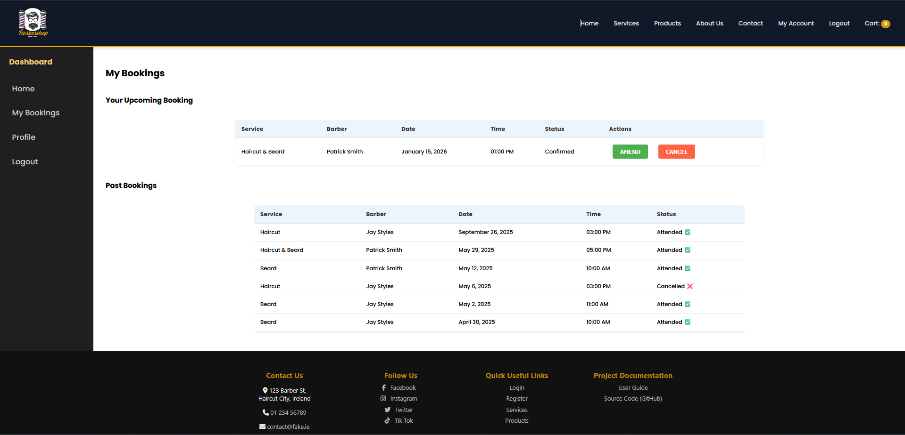
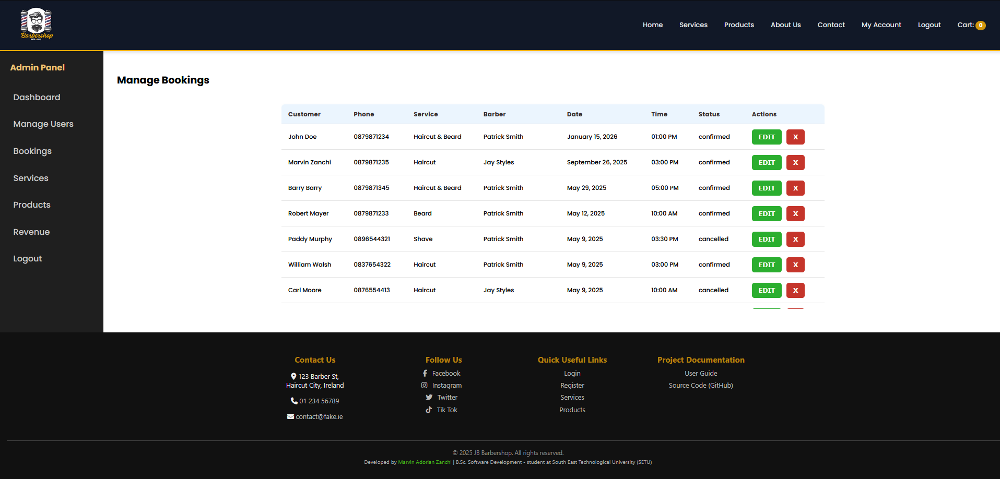
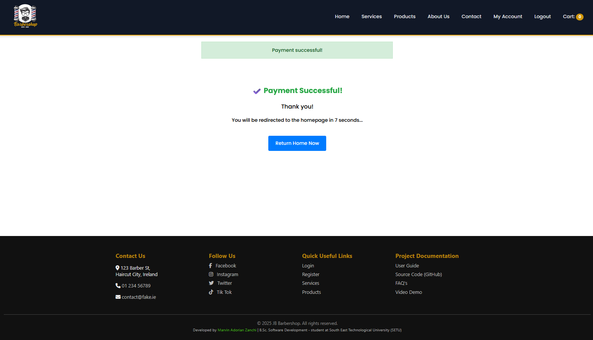

## 💈 BookStyle — Online Booking & Product System (Barber Shop)

BookStyle is a **full-stack web application** designed to simplify barber appointment bookings while also providing a **product section (mini eCommerce)** for grooming items such as beard balm and shampoo.

The system includes **dedicated dashboards for users and administrators**, enabling efficient management of bookings, products, and system activity.

This project was developed as an **individual 3rd-year academic project** as part of the **BSc (Hons) in Software Development**.

---

## 🎯 Project Overview

BookStyle supports **three user roles** — **Customers**, **Barbers**, and **Admins** — each with role-based access and dedicated functionality.

The project focuses on designing and implementing a **complete web-based system**, covering:
- User authentication and role-based access control
- Backend business logic
- Database design
- Booking and product management
- Administrative dashboards
- Secure online payments

> ℹ️ *This project reflects the final academic submission. The only post-assessment changes are documentation improvements and the addition of screenshots for portfolio presentation.*


---

## 🚀 Features

### 👤 Customers
- Register and log in securely
- Browse and book available barber services
- View, amend, or cancel bookings
- Browse grooming products (e.g. beard balm, shampoo)
- Purchase products via Stripe
- Access a **personal user dashboard** to manage bookings and orders

### ✂️ Barbers
- View upcoming appointments
- Manage availability
- Track booking requests

### 🛠️ Administrators
- Access a **dedicated admin dashboard**
- Full CRUD management for users, barbers, services, and products
- Monitor bookings and system activity
- *(Planned)* Revenue statistics and analytics

---

## 🧰 Tech Stack

### Frontend
- HTML5  
- CSS3  
- JavaScript (basic client-side scripting)

### Backend
- PHP  
- Custom MVC-style architecture

### Database
- MySQL

### Other
- Stripe API (payment integration)
- Session-based authentication
- Role-based access control
- Hosting via Plesk (academic environment)

---

## 🔄 Development Process (Agile)

The project was developed over approximately **10 weeks**, following an **Agile-style iterative approach**:

- Features were planned and prioritised before implementation  
- Development progressed incrementally across iterations  
- Weekly meetings were held with a supervisor to review progress and adjust requirements  
- Design decisions and progress were documented throughout the project lifecycle  

This approach enabled continuous refinement while working under academic deadlines.

---

## 🧠 Key Technical Challenges

A key technical challenge was the **integration of Stripe payments**, including:
- Secure handling of payment sessions
- Ensuring bookings and product orders are confirmed only after successful payment
- Coordinating backend logic across multiple user roles

This required careful coordination between frontend interactions, backend processing, and database updates.

---

## 📈 Future Improvements

Given more time, the following improvements would be prioritised:

- Improve **mobile responsiveness** and overall **UX**
- Complete and extend **revenue statistics and analytics** in the admin dashboard
- Further refactor UI components for scalability and maintainability

---

## 📸 Screenshots

**Homepage / Landing Page**  


**Booking Flow**  


**Products Page**  


**Checkout / Cart Page**  


**Login Page**  


**User Dashboard**  


**Admin Dashboard**  


**Confirmation Page**  


---

## ⚙️ Setup Instructions

### 1️⃣ Clone the repository

```bash
git clone https://github.com/mazds-dev/BookStyle-booking-system.git
cd BookStyle-booking-system
```

### 2️⃣ Environment requirements

* PHP 7.4+
* MySQL
* Apache or compatible web server (XAMPP, MAMP, etc.)

### 3️⃣ Database setup

1. Create a MySQL database (`bookstyle_db`)
2. Import the SQL file:
   * `barbershop_services.sql`

3. Update database credentials in:
   * `/app/models/Database.php`

### 4️⃣ Run locally

Place the project inside your web server root directory and open:

```text
http://localhost/BookStyle-booking-system/public
```

---

## 👤 Project Ownership

* **Individual project**
* Backend logic, database schema, and overall architecture were **designed and implemented independently**

---

## 🌐 Live Demo

This project was deployed in an academic hosting environment during development.
The public demo has been taken offline for security reasons.

---

## 👨‍💻 Author

**Marvin Adorian Zanchi**
BSc (Hons) Software Development – Student

* GitHub: [https://github.com/mazds-dev](https://github.com/mazds-dev)
* Portfolio: [https://mazds-dev.github.io/MyPortfolio/](https://mazds-dev.github.io/MyPortfolio/)
